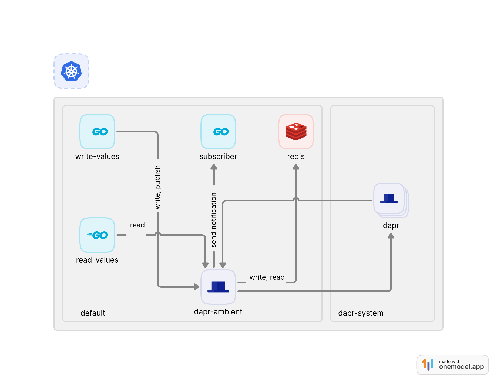

# dapr-go

This repository aims to show how to use Dapr Ambient and Dapr building blocks (State management and Pub/Sub) with multiples services into a cluster kubernetes.

## Architecture
Below, you can see a high-level and simple architecture used on this example.



### subscriber

Subscriber just listen by notifications sent from [write-values](#write-values). This component receives all notifications and requests from `dapr` through `dapr-ambient` proxy.

### write-values

Write-values is responsible for save values into `redis` through `dapr-ambient`.

```
curl -X POST http://192.168.200.5:80?value=90
```

### read-values

Read-values reads all values created by `write-values` and returns an average.

```
curl http://192.168.200.4:80
```

## Installation

### minikube

```bash
make start-minikube
```

### [Dapr](https://docs.dapr.io/operations/hosting/kubernetes/kubernetes-deploy/)

```bash
make deploy-dapr
```

Uninstall
```bash
make undeploy-dapr
```

### Components (Redis etc.)

```bash
make deploy-components

Uninstall Components
```bash
make undeploy-components
```

### Workloads (services)

```bash
make deploy-workloads

Uninstall Workloads
```bash
make undeploy-workloads
```

### References

* [DAPR arguments annotations overview](https://docs.dapr.io/reference/arguments-annotations-overview/)
* [Reference secrets in components - Non-default namespaces](https://docs.dapr.io/operations/components/component-secrets/#non-default-namespaces)
* [go-sdk examples](https://github.com/dapr/go-sdk/tree/main/examples/pubsub)
* [dapr-shared-examples](https://github.com/salaboy/dapr-shared-examples)
