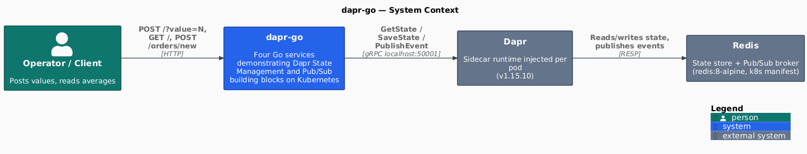
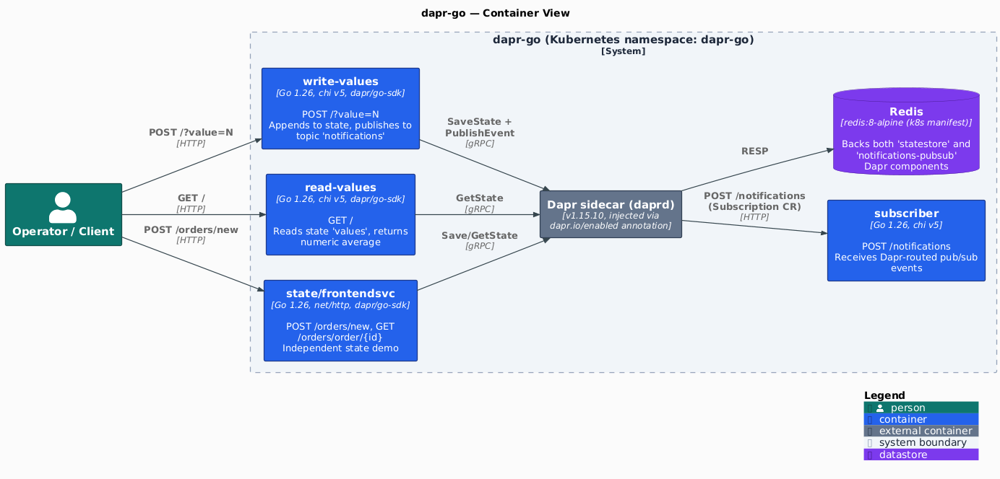
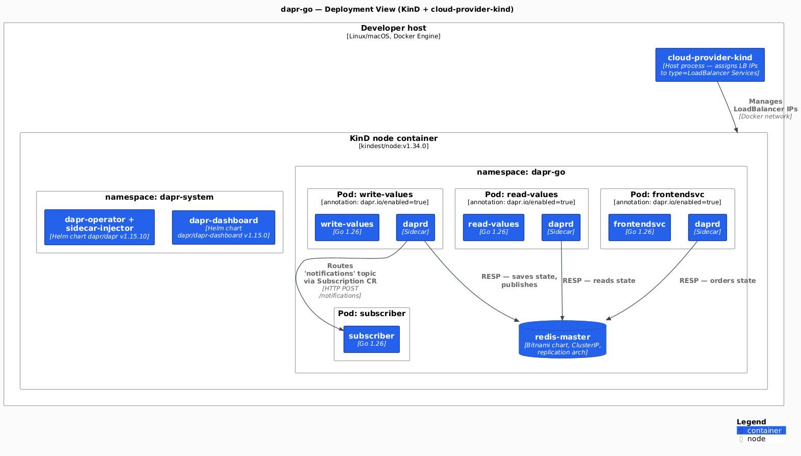

[](https://github.com/AndriyKalashnykov/dapr-go/actions/workflows/ci.yml)
[](https://hits.sh/github.com/AndriyKalashnykov/dapr-go/)
[](https://opensource.org/licenses/Apache-2.0)
[](https://app.renovatebot.com/dashboard#github/AndriyKalashnykov/dapr-go)

# Dapr State + Pub/Sub Reference for Go

Reference implementation of Dapr's State Management and Pub/Sub building blocks in Go, running on Kubernetes via per-pod sidecar injection — four independent Go modules that interact only through their `daprd` sidecars over localhost gRPC. The **runtime surface** exposes chi-routed HTTP handlers backed by a single Redis (`redis:8-alpine`) instance serving as both the Dapr state store and pub/sub broker on KinD + `cloud-provider-kind`; the **delivery surface** covers an `mise`-pinned toolchain, a golangci-lint + govulncheck + gitleaks + actionlint (shellcheck-backed) + PlantUML diagram-drift static gate, Testcontainers-driven integration tests, a KinD end-to-end harness, and a Trivy-gated, cosign keyless-signed multi-arch GHCR publish pipeline kept current by Renovate.

<p align="center"></p>

| Component | Technology | Rationale |
|-----------|-----------|-----------|
| Language | Go 1.26.4 (multi-module — one `go.mod` per service) | No shared workspace keeps each service independently versioned and releasable |
| HTTP routers | [chi](https://github.com/go-chi/chi) v5 (read-values, write-values, subscriber); `net/http` (frontendsvc) | Lightweight router, no framework lock-in for a Dapr-fronted service |
| Dapr client | [dapr/go-sdk](https://github.com/dapr/go-sdk) v1.15.0 | Official SDK for state/pub-sub calls over the sidecar gRPC API |
| Runtime | Dapr 1.18.1 — sidecar-injection model | `dapr.io/enabled` pod annotations avoid a shared daprd process per node |
| State store + pub/sub broker | Redis 8 (`redis:8-alpine`, single instance, plain k8s manifest in `k8s/redis/`) | Replaces the former Bitnami Helm chart, whose public catalog broke in 2025 |
| Local cluster | [KinD](https://kind.sigs.k8s.io/) v0.32 + [cloud-provider-kind](https://github.com/kubernetes-sigs/cloud-provider-kind) v0.11 | Real `LoadBalancer` IP assignment on a laptop-sized cluster, no Minikube tunnel |
| Toolchain manager | [mise](https://mise.jdx.dev/) (`.mise.toml` pins go, kind, kubectl, helm, dapr-cli, golangci-lint, govulncheck, gitleaks, actionlint, shellcheck, act, cloud-provider-kind) | One version-pin source Renovate can bump uniformly; replaces per-tool `go install`/curl installers |
| Static analysis | [golangci-lint](https://golangci-lint.run/) (gocritic, gosec via `.golangci.yml`), [govulncheck](https://go.dev/security/vuln/), [gitleaks](https://github.com/gitleaks/gitleaks), [actionlint](https://github.com/rhysd/actionlint) | Catches code smells, known CVEs, committed secrets, and workflow-YAML bugs before push |
| Testing | [Testcontainers-go](https://golang.testcontainers.org/) (Redis) | Validates the JSON wire-format roundtrip and cross-service contract without a live cluster |
| Security scanning | [Trivy](https://github.com/aquasecurity/trivy) (filesystem + image, HIGH/CRITICAL fixed-only), [cosign](https://github.com/sigstore/cosign) keyless OIDC signing | Blocks known-vulnerable images pre-publish; signs every published digest for supply-chain verification |
| Container build | Docker Buildx (QEMU, `linux/amd64` + `linux/arm64`) | Single Dockerfile cross-compiles via `BUILDPLATFORM`/`TARGETARCH`, no per-arch Dockerfile |
| Dependency management | [Renovate](https://docs.renovatebot.com/) (`gomod`, `github-actions`, `dockerfile`, `kubernetes`, `mise`, `custom.regex` managers) | Keeps every pinned version — including `.mise.toml` — current automatically |
| CI | GitHub Actions | `changes` → `static-check` → `build`/`test`/`integration-test` → `e2e` → `docker` → `ci-pass` |

## Quick Start

```bash
make deps                 # install the mise-pinned toolchain (go, kind, kubectl, helm, dapr-cli, golangci-lint, govulncheck, gitleaks, actionlint, shellcheck, act, cloud-provider-kind)
make kind-deploy          # kind-up → deploy-dapr → deploy-components → deploy-workloads
```

`kind-deploy` brings up a complete environment: KinD cluster, Dapr control plane, Redis state store + pub/sub broker, and all four services with sidecars injected. `cloud-provider-kind` runs in the background and assigns external IPs to the `LoadBalancer` Services automatically.

Tear down in reverse:

```bash
make undeploy-workloads   # remove application workloads
make undeploy-components  # remove Redis + the Secret
make undeploy-dapr        # remove the Dapr control plane
make kind-down            # delete the cluster + prune kindccm-* orphan sidecars
```

Smoke-test the deployed services after `kubectl --context kind-dapr-go -n dapr-go get svc` lists assigned LoadBalancer IPs:

```bash
curl -X POST 'http://<write-values-ip>/?value=90'   # publish a value
curl 'http://<read-values-ip>/'                      # returns running average
```

## Prerequisites

| Tool | Version | Purpose |
|------|---------|---------|
| [GNU Make](https://www.gnu.org/software/make/) | 3.81+ | Build orchestration |
| [Git](https://git-scm.com/) | latest | Version control |
| [Docker](https://www.docker.com/) | latest | Container builds + KinD nodes + `cloud-provider-kind` |
| [mise](https://mise.jdx.dev/) | latest | Pins go, kind, kubectl, helm, dapr-cli, golangci-lint, govulncheck, gitleaks, actionlint, shellcheck, act, cloud-provider-kind per `.mise.toml` (auto-installed by `make deps`) |

```bash
make deps
```

`make deps` bootstraps mise (if absent) and runs `mise install` against `.mise.toml` — every lint/security/e2e tool is mise-managed; nothing is installed via `go install` or a curl script.

## Architecture

Four independent Go services interact only through Dapr — none of them call Redis or each other directly. Every service-to-Dapr call goes via the per-pod `daprd` sidecar over localhost gRPC.

```text
client ── POST ─▶ write-values  ── SaveState ────▶  Redis (statestore key "values")
                                ── PublishEvent ─▶  notifications-pubsub / topic "notifications" ──▶ subscriber

client ── GET ──▶ read-values   ── GetState ─────▶  Redis (statestore key "values")  → returns average as a float64
```

Component manifests live in `k8s/dapr/components/` (Redis-backed `statestore` and `notifications-pubsub`); workload manifests live in `k8s/apps/`; the Redis Deployment + Service live in `k8s/redis/redis.yaml` (a single `redis-master` instance, no replication). The Redis password is held in the `redis-password-secret` k8s Secret and consumed by the components via `secretKeyRef`.

<p align="center"></p>

The container view shows each of the four services calling its own `daprd` sidecar over gRPC; the sidecar is the only thing that ever talks to Redis (`redisHost: redis-master.dapr-go.svc.cluster.local:6379`) over RESP.

<p align="center"></p>

The deployment view shows the `dapr-go` namespace holding all four service Deployments (each with an injected `daprd` sidecar), the `redis-master` Deployment, and the Dapr control-plane components (`dapr-operator`, `dapr-sidecar-injector`, `dapr-placement`, `dapr-sentry`) in `dapr-system`, installed via the Dapr Helm chart.

Source diagrams in `docs/diagrams/`; regenerate with `make diagrams`.

## API / Usage

| Service | Endpoint | Behaviour |
|---------|----------|-----------|
| `write-values` | `POST /?value=N` | Appends `N` to JSON `MyValues{Values []string}` at key `values`; publishes raw `N` on the `notifications` topic. |
| `read-values` | `GET /` | Reads `values`, parses each entry as `int`, returns the average as a `float64` (`total/count`, count-zero safe). |
| `subscriber` | `POST /notifications` | Receives every event from the `notifications` topic via the Dapr `Subscription` CR. |
| `state/frontendsvc` | `POST /orders/new`, `GET /orders/order/{id}` | Standalone state-management demo; not part of the read/write pipeline. |

### Service environment variables

All services read configuration via `GetenvOrDefault`:

| Variable | Default | Used by |
|----------|---------|---------|
| `APP_PORT` | `8080` | all services |
| `STATE_STORE_NAME` | `statestore` | read-values, write-values |
| `PUB_SUB_NAME` | `notifications-pubsub` | write-values |
| `PUB_SUB_TOPIC` | `notifications` | write-values |

## Build & Package

The build pipeline produces two artefact tiers per service, each gated by a separate `make` target:

| Stage | Command | Output | Notes |
|-------|---------|--------|-------|
| Compile | `make build` | `<service>/main` (current platform) | `make build-linux-amd64` cross-compiles for the container image |
| OCI image | `make image-build` | `ghcr.io/andriykalashnykov/dapr-go/<service>:<tag>` (local Docker daemon, `linux/amd64`, `--load`) | Multi-stage Dockerfile (`golang:1.26-alpine` builder → `alpine:3.23` runtime, non-root UID 10001) |

For tag-gated registry publication see [CI/CD](#cicd) — the `docker` job builds each of the four services for scan, Trivy-scans, smoke-tests, pushes multi-arch (`linux/amd64,linux/arm64`) to GHCR, and cosign-signs every digest.

### Testing

The project uses a three-layer test pyramid:

- **`make test`** (seconds, no Docker) — unit tests with `-race -cover`. Fakes the Dapr client via a minimal interface defined at the use site, exhausts handler logic and error branches.
- **`make integration-test`** (~10s, Docker required) — Testcontainers Redis + go-redis. Validates JSON wire-format roundtrip and the cross-service contract between write-values' producer shape and read-values' parser. Build-tagged `integration` so unit runs stay fast.
- **`make e2e`** (minutes, requires KinD + Docker) — runs `e2e/e2e-test.sh` against an already-running cluster: state roundtrip, pub/sub roundtrip, frontendsvc CRUD, and a 404 negative case. Use `make e2e-full` from a fresh checkout to bring up the cluster and run e2e in one command.

## Available Make Targets

Run `make help` to see all targets.

### Environment

| Target | Description |
|--------|-------------|
| `make deps` | Full dev environment (all tools via mise — see `.mise.toml`) |
| `make deps-tools` | Install the mise-managed toolchain (Go, kind, kubectl, helm, dapr, golangci-lint, govulncheck, gitleaks, actionlint, shellcheck, act, cloud-provider-kind) |
| `make deps-act` | Install act (local GitHub Actions runner) — mise-managed; alias for `deps-tools` |

### Build & Test

| Target | Description |
|--------|-------------|
| `make build` | Build all service binaries for the current platform |
| `make build-linux-amd64` | Cross-compile all services for `linux/amd64` (used by `image-build`) |
| `make test` | Run unit tests (`-race -cover`) for every service module |
| `make integration-test` | Run integration tests against real Redis via Testcontainers (requires Docker) |
| `make get` | Download dependencies + `go mod tidy` in every service module |
| `make update` | Update dependencies to latest versions in every service module |
| `make clean` | Remove compiled binaries |

### Static Analysis / Security

| Target | Description |
|--------|-------------|
| `make check-toolchain-alignment` | Verify Go version matches across every `go.mod`, `.mise.toml`, and Dockerfile (prevents Renovate split-PR deadlock) |
| `make lint` | Run golangci-lint across every service module (includes gocritic, gosec via `.golangci.yml`) |
| `make lint-ci` | Lint GitHub Actions workflows (actionlint; uses shellcheck for embedded `run:` blocks) |
| `make vulncheck` | Run govulncheck across every service module |
| `make secrets` | Scan for hardcoded secrets (gitleaks) |
| `make trivy-fs` | Trivy filesystem scan (vuln+secret+misconfig; HIGH+CRITICAL, fixed-only) |
| `make static-check` | Composite static gate (toolchain alignment + lint-ci + lint + vulncheck + secrets + diagrams-check + trivy-fs) |

### Container images

| Target | Description |
|--------|-------------|
| `make image-build` | Build local Docker images for all services (`linux/amd64`, `--load`) — Dockerfile does its own Go build |
| `make image-push` | Build and push multi-arch images (`linux/amd64,linux/arm64`) to the registry |

### KinD cluster + Dapr lifecycle

| Target | Description |
|--------|-------------|
| `make kind-up` / `make kind-down` | Create the KinD cluster + start `cloud-provider-kind` / delete the cluster + prune `kindccm-*` orphan sidecars |
| `make kind-deploy` | Full bring-up — `kind-up` → `deploy-dapr` → `deploy-components` → `deploy-workloads` |
| `make kind-destroy` | Tear everything down (alias for `kind-down`) |
| `make deploy-dapr` / `make undeploy-dapr` | Install / remove the Dapr control plane on the KinD cluster |
| `make deploy-components` / `make undeploy-components` | Deploy / remove Redis (state store + pub/sub broker) + `redis-password-secret` |
| `make deploy-workloads` / `make undeploy-workloads` | Build images, load into KinD, apply k8s manifests / remove the application workloads |
| `make e2e` | End-to-end smoke test on a running KinD cluster (state + pubsub roundtrip + frontendsvc CRUD) |
| `make e2e-full` | Convenience: `kind-up` → `deploy-dapr` → `deploy-components` → `deploy-workloads` → `e2e` (fresh-checkout flow) |

### Diagrams

| Target | Description |
|--------|-------------|
| `make diagrams` | Render all PlantUML sources to `docs/diagrams/out/*.png` |
| `make diagrams-check` | Verify committed PNGs are in sync with `.puml` sources (fails on untracked drift too) |
| `make diagrams-clean` | Remove rendered diagram PNGs |

### CI

| Target | Description |
|--------|-------------|
| `make ci` | Full local CI pipeline (`deps` → `static-check` → `test` → `integration-test` → `build` → `image-build`) |
| `make ci-run` | Run the GitHub Actions workflow locally via [act](https://github.com/nektos/act) (jobs serialized) |
| `make renovate-validate` | Validate Renovate configuration |

### Release

| Target | Description |
|--------|-------------|
| `make version` | Print current version (git tag) |
| `make release NEWTAG=vX.Y.Z` | Tag a new release — guards against a pre-existing tag, prompts `[y/N]` before committing `version.txt` and pushing the tag |

## CI/CD

`.github/workflows/ci.yml` runs on push to `main`, tags `v*`, pull requests, and via `workflow_call`:

| Job | Triggers | Steps |
|-----|----------|-------|
| `changes` | every event | `dorny/paths-filter` — emits `code=true` for non-doc-only changes |
| `static-check` | when `code=true` | `jdx/mise-action` bootstrap + `make static-check` (toolchain alignment, actionlint, golangci-lint, govulncheck, gitleaks, diagrams-check, trivy-fs) |
| `build` | after `static-check` | `make build` + `make image-build` |
| `test` | after `static-check` | `make test` |
| `integration-test` | after `static-check` | `make integration-test` (Testcontainers Redis) |
| `e2e` | after `build`, `test` | `make kind-deploy` → `make e2e` → `make kind-down` (always); diagnostic dump on failure |
| `docker` | tag-gated (`v*` only); requires `e2e` to have succeeded | Per-service matrix: build for scan → Trivy → smoke → multi-arch push → cosign sign |
| `ci-pass` | always | Aggregator — fails if any required upstream job failed/cancelled |

### Pre-push image hardening

The `docker` job runs the following gates **before** any image is pushed to GHCR. Any failure blocks the release for that service. Runs as a 4-way matrix (read-values, write-values, subscriber, frontendsvc).

| # | Gate | Catches | Tool |
|---|------|---------|------|
| 1 | Build local single-arch image (linux/amd64, `--load`) | Build regressions on the runner architecture; multi-stage Go build inside the container | `docker/build-push-action` with `load: true` |
| 2 | **Trivy image scan** (CRITICAL/HIGH, fixed only) | CVEs in the alpine base, Go binary, and transitive deps | `aquasecurity/trivy-action` with `image-ref:` |
| 3 | **Smoke test** | Image boots correctly on its own. `subscriber` uses a boot-marker probe; the Dapr-using services (which `dapr.NewClient()` upstream and exit without a sidecar) use a container-shape probe asserting UID 10001 + `/app/main` is owned by `app:app` and executable. | `docker run` |
| 4 | Multi-arch build + push | Publishes for both `linux/amd64` and `linux/arm64` | `docker/build-push-action` with `provenance: false` + `sbom: false` |
| 5 | **Cosign keyless OIDC signing** | Sigstore signature on the manifest digest | `sigstore/cosign-installer` + `cosign sign --yes` |

Buildkit in-manifest attestations (`provenance` + `sbom`) are deliberately disabled so the image index stays free of `unknown/unknown` platform entries — that lets the GHCR Packages UI render the "OS / Arch" tab for the multi-arch manifest. Cosign keyless signing still provides a Sigstore signature for supply-chain verification.

Verify a published image's signature with:

```bash
cosign verify ghcr.io/andriykalashnykov/dapr-go/<svc>:<tag> \
  --certificate-identity-regexp 'https://github\.com/AndriyKalashnykov/dapr-go/\.github/workflows/ci\.yml@refs/tags/v.*' \
  --certificate-oidc-issuer https://token.actions.githubusercontent.com
```

Concurrency uses `cancel-in-progress: true`. Workflow-level permissions default to `contents: read` (least privilege); the `docker` job adds `packages: write` + `id-token: write` at job level.

`.github/workflows/cleanup-runs.yml` prunes old workflow runs every Sunday (cron) and supports manual dispatch.

### Required Secrets and Variables

No custom secrets or variables are required. The `docker` job authenticates to GHCR and signs images using only the automatically-provided `GITHUB_TOKEN` (via `id-token: write` for cosign's keyless OIDC flow) — no repository secrets need to be configured.

[Renovate](https://docs.renovatebot.com/) keeps dependencies (Go modules, GitHub Actions, Dockerfile bases, k8s image refs, and the `.mise.toml` toolchain) up to date, merging via `automergeType: "pr"` (squash) gated by the required `ci-pass` status check — native platform automerge is deliberately disabled to avoid racing check registration. GitHub Dependabot vulnerability alerts are enabled and fast-tracked by Renovate's `vulnerabilityAlerts` rule (`automerge: true`, `minimumReleaseAge: "0 days"`).

## Contributing

Fork the repo, branch off `main`, and open a pull request — `make ci` mirrors the full CI pipeline locally (`deps` → `static-check` → `test` → `integration-test` → `build` → `image-build`), and `make ci-run` replays the GitHub Actions workflow itself via [act](https://github.com/nektos/act) before you push.

## References

- [Dapr arguments and annotations overview](https://docs.dapr.io/reference/arguments-annotations-overview/)
- [Reference secrets in components — non-default namespaces](https://docs.dapr.io/operations/components/component-secrets/#non-default-namespaces)
- [dapr/go-sdk pubsub examples](https://github.com/dapr/go-sdk/tree/main/examples/pubsub)

## License

Licensed under the [Apache License 2.0](LICENSE).
